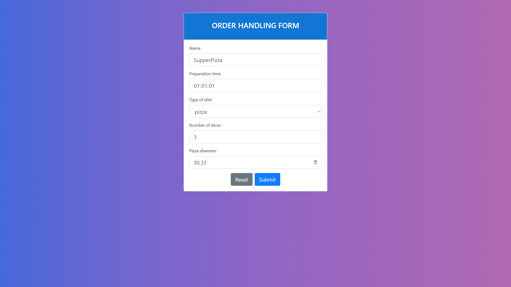
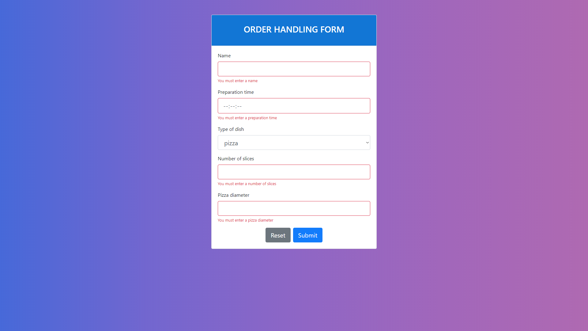

# Form_recruitment_task 

## 1. General info
This project is about creating a form to handle orders. The form contains various types of fields and conditional rendering.
## 2. Setup
 1. Clone or download repository
 2. npm install
 3. npm start
 
## 3. Technologies
* React.js
* Redux
* Redux Form
* create-react-app
* react-redux
* axios
* reactstrap

## 4. Screenshots

